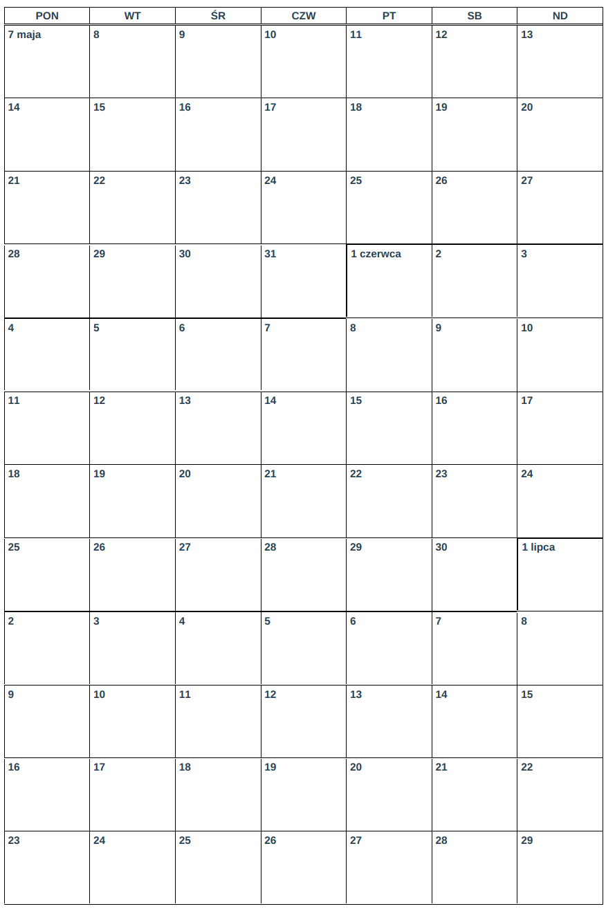

# print-calendar

Renders a dense 12 weeks calendar to be printed in one A4 sheet. It starts from today or a day passed in url

[](print-calendar.png)

## Getting Started

### Prerequisites

You need to install npm or yarn

### Installing

To install dependencies

```
yarn  install
```

And to run project

```
yarn serve
```

Then you can go to `http://localhost:8080` in your browser to see the calendar.

You may specify exact day to start from, passing it in URL. Example: `http://localhost:8080/#/12-05-2018`

But allowed are also:
```
http://localhost:8080/#/12  # day only (current month and year by default)
http://localhost:8080/#/12-05  # day and month only (current year by default)
```

or in other format (with dot separators)
```
http://localhost:8080/#/12.05
http://localhost:8080/#/12.05.2018
```

## Deployment

To build project for production, run:

```
yarn build
```

## Built With

* [Vue](https://github.com/vuejs/vue) - A progressive, incrementally-adoptable JavaScript framework for building UI on the web
* [Vue CLI](https://github.com/vuejs/vue-cli) - CLI for rapid Vue.js development
* [Vue Router](https://github.com/vuejs/vue-router) - The official router for Vue.js
* [MomentJS](https://github.com/moment/moment) - Parse, validate, manipulate, and display dates in javascript

## License

This project is licensed under the MIT License - see the [LICENSE.md](LICENSE.md) file for details

## Acknowledgments

* I used to see my friend typing all numbers in Word document manually and playing with borders' widths every two months. However, her idea of having one-A4-sheet calendar was appealing to me. So I decided to automate the process of preparing it.
